# Migrating-to-the-Cloud-with-Conterization_P20
---
## Migrate a tooling and PHP-TODO app into a containerized application

# Install Docker and prepare for migration to the Cloud
 First we need to install docker engine which is a client-server application that contains 
 - A server with a long-running daemon process `dockerd`.
- APIs that specify interfaces that programs can use to talk to and instruct the Docker daemon.
- A command-line interface (CLI) client docker
## For tooling app
-------------
Let us start assembling our application from the Database layer- we will use a pre-built MySQL database container, configure it, and make sure it is ready to receive requests from our PHP application.
### Step1: Pull MYSQL Docker image from [Docker Hub registry](https://hub.docker.com/)
Start by pulling the appropriate Docker image for MySQL. You can download a specific version or opt for the latest release, as seen in the following command:
`docker pull mysql/mysql-server:latest` 
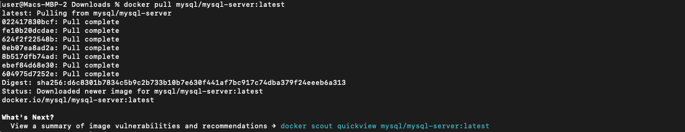
List the images to check that you have downloaded them successfully:
`docker images ls`
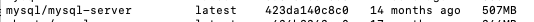

### Step 2: Create a network and run MySQL
Creating a custom network isn't always necessary because Docker automatically assigns containers to the default network, typically using the Bridge driver. You can confirm this by running docker network ls.

However, there are scenarios where a custom network is useful. For instance, if you need to control the IP address range of containers in your application stack, creating a network with a specified --subnet becomes essential.

In our case, for clarity and organization, we'll create a dedicated network with its own subnet. This will ensure seamless connectivity between MySQL and our application.

`docker network create --subnet=172.18.0.0/24 tooling_app_network`

let us create an environment variable to store the MySQL root password 
`export MYSQL_PW=olalekan`
 lets run the mysql using our already created network 
 ` docker run --network tooling_app_network -h mysqlserverhost --name=mysql-server -e MYSQL_ROOT_PASSWORD=$MYSQL_PW -d mysql/mysql-server:latest`

Flags used

-d runs the container in detached mode
--network connects a container to a network
-h specifies a hostname
If the image is not found locally, it will be downloaded from the registry but we already pulled the MySQL image in step 1.

Verify the container is running
`docker ps`

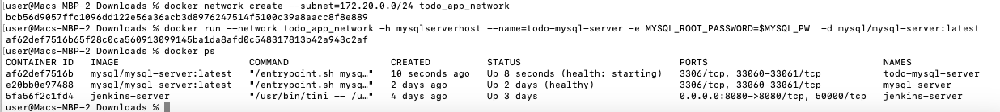
### Step 3: Create database

As you already know, it is best practice not to connect to the MySQL server remotely using the root user. Therefore, we will create an SQL script that will create a user we can use to connect remotely.

Create a file and name it create_user.sql and add the below code in the file:

`CREATE USER '<user>'@'%' IDENTIFIED BY '<client-secret-password>';
GRANT ALL PRIVILEGES ON * . * TO '<user>'@'%';`

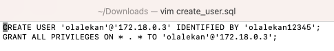

Run the script:
docker exec -i mysql-server mysql -uroot -p$MYSQL_PW < ./create_user.sql

### Step 4: Connecting to MySQL Server using another MySQL client container

By leveraging another MySQL client container to connect to the MySQL server, we eliminate the need to install any client tools on our local machine. This approach allows us to interact with the MySQL server seamlessly without directly connecting to the container running the server. As a result, managing databases becomes more efficient and convenient.

Run the MySQL Client Container
`docker run --network tooling_app_network --name mysql-client -it --rm mysql mysql -h myserverhost -u "<user-created-from-the-sql-script>" -p`

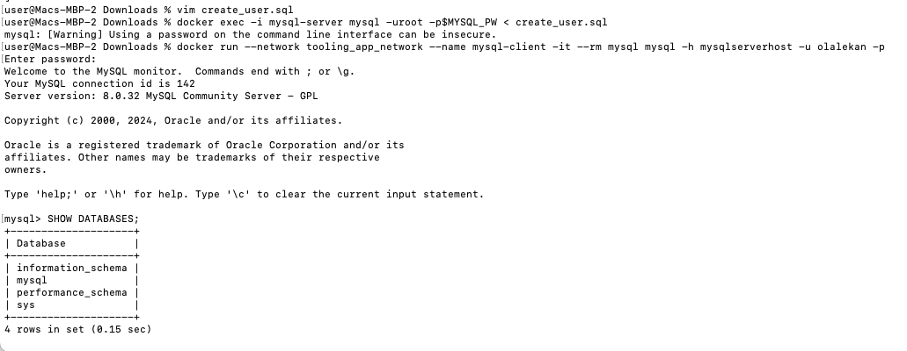


Flags used:
- --name gives the container a name
- -it runs in interactive mode and Allocate a pseudo-TTY
- --rm automatically removes the container when it exits
- 	--network connects a container to a network
-	-h a MySQL flag specifying the MySQL server Container hostname
-	-u user created from the SQL script
-	-p password specified for the user created from the SQL script


**Prepare database schema**

Now you need to prepare a database schema so that the Tooling application can connect to it.
1.	Clone the Tooling-app repository from here 
git clone this [repo](https://github.com/babslekson/tooling.git)
2.	On your terminal, export the location of the SQL file
export tooling_db_schema=~/tooling/html/tooling_db_schema.sql
You can find the tooling_db_schema.sql in the html folder of cloned repo.
3.	Use the SQL script to create the database and prepare the schema. With the docker exec command, you can execute a command in a running container.
docker exec -i mysql-server mysql -uroot -p$MYSQL_PW < $tooling_db_schema

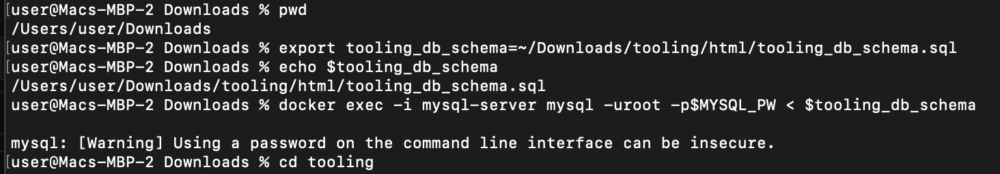

4.	Update the db_conn.php file with connection details to the database
```bash
$servername = "mysqlserverhost";
$username = "<user>";
$password = "<client-secret-password>";
$dbname = "toolingdb";
```
### Step 5: Run the Tooling App

Containerization of an application starts with creation of a file with a special name Dockerfile (without any extensions). This can be considered as a recipe or instruction that tells Docker how to pack your application into a container.

Refer to the Dockerfile in this [repo](https://github.com/babslekson/tooling.git) it was created for this purpose.
 So, let us containerize our tooling app
 - Make sure you are inside the `Dockerfile` directory. Run `docker build
 
 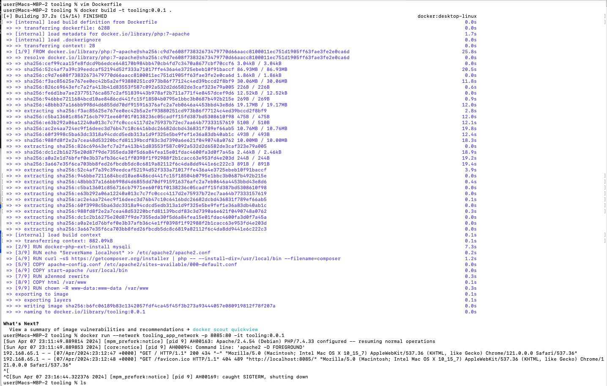

 In the above image, we specify a parameter -t, so that the image can be tagged`tooling"0.0.1` - Also, you have to notice the `.` at the end. This is important as that tells Docker to locate the `Dockerfile` in the current directory you are running the command. Otherwise, you would need to specify the absolute path to the `Dockerfile`.
 
 - Now that the image is built. let us lauch our container with `docker run`
 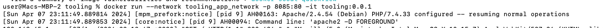
 •	From the image above we specify the --network flag so that both the Tooling app and the database can easily connect on the same virtual network we created earlier.
 •	The -p flag is used to map the container port with the host port. Within the container, apache is the webserver running and, by default, it listens on port 80. You can confirm this with the CMD ["start-apache"] section of the Dockerfile. But we cannot directly use port 80 on our host machine because it is already in use. The workaround is to use another port that is not used by the host machine. In our case, port 8085 is free, so we can map that to port 80 running in the container.
 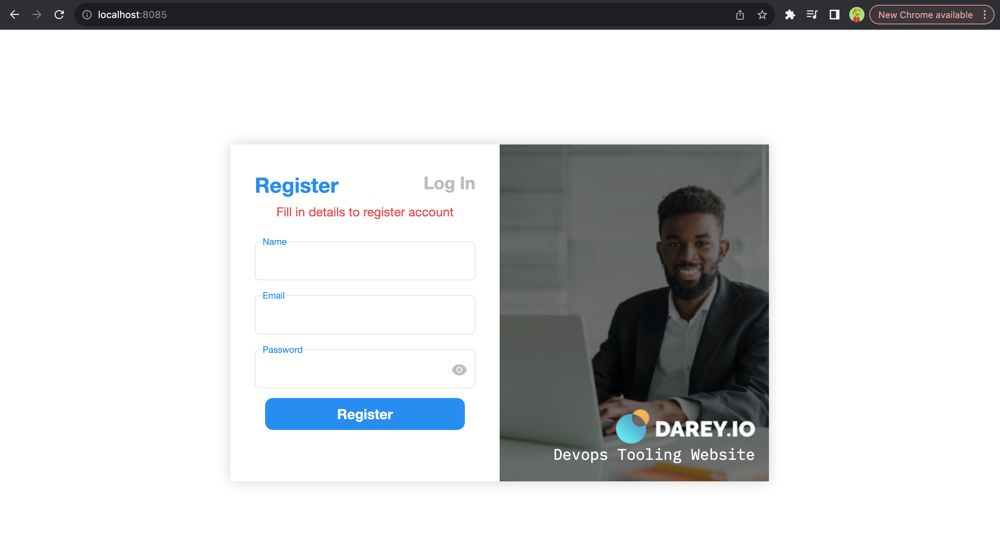
 
 ## Deployment with Docker compose

 We've invested significant effort in creating an image and deploying our application inside it. However, relying solely on running Docker commands in the terminal isn't always ideal for launching our applications. Fortunately, there are solutions available that simplify this process by enabling us to write declarative code in YAML format. With just a single command, we can effortlessly bring up all our applications and their dependencies.
 
 In this section, we will refactor the Tooling app POC so we can leverage the power of Docker Compose
 1. Create a file, name it tooling.yaml (it can be any name of your choice)
 2. Write the docker compose with YAML syntax. The YAML file is used for defining services, networks, and volumes.

 - Content of the `tooling.yaml`
 ```bash
 version: "3.9"
 services:
   tooling_frontend:
     build: .
     ports:
       - "5001:80"
     volumes:
       - tooling_frontend:/var/www/html
     links:
       - db
   db:
     image: mysql
     restart: always
     environment:
       MYSQL_DATABASE: <The database name required by Tooling app >
       MYSQL_USER: <The user required by Tooling app >
       MYSQL_PASSWORD: <The password required by Tooling app >
       MYSQL_RANDOM_ROOT_PASSWORD: '1'
     volumes:
       - db:/var/lib/mysql
 volumes:
   tooling_frontend:
   db:
 ```
 Run the docker compose 
 `docker-compose -f tooling.yaml  up -d`
 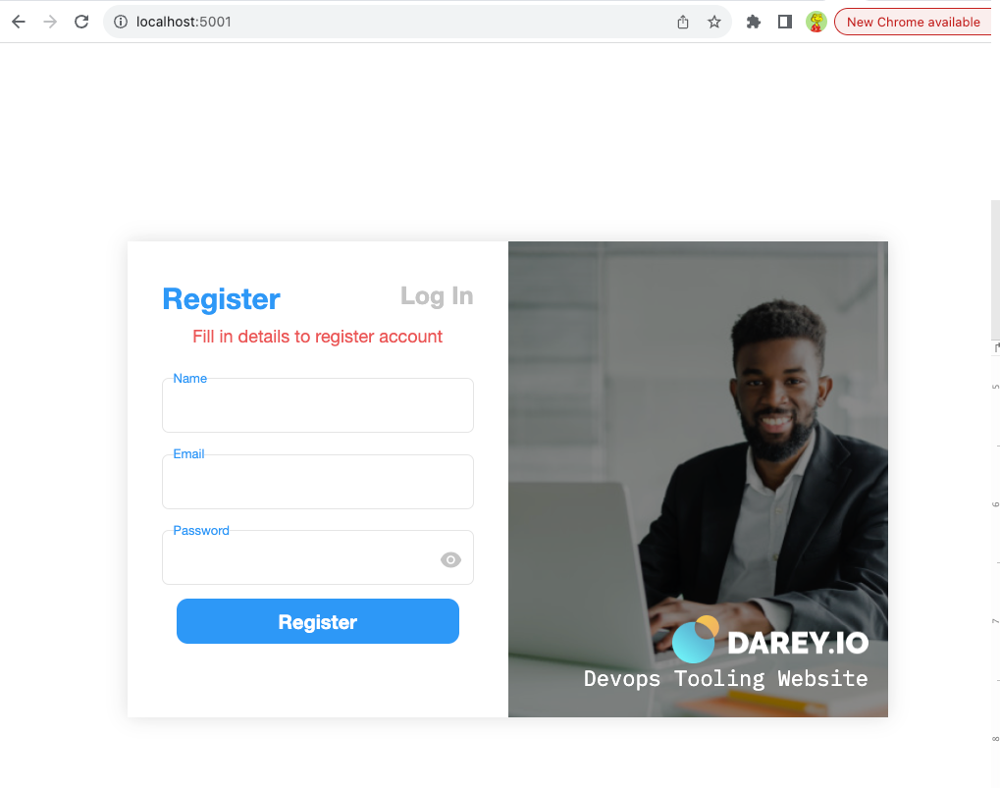

 ## Push Docker image to container repository
 Lets go ahead to push our Docker image from the local machine to a container registry. In this case Docker Hub.

1. Please make sure you have a [Docker Hub repository](https://hub.docker.com/) account before you proceed.

2. Create a new Docker Hub repository
3. Push the docker images from your pc to the repo
```
docker login
docker build -t babslekson/tooling:0.0.1 .
docker push babslekson/tooling:0.0.1
```
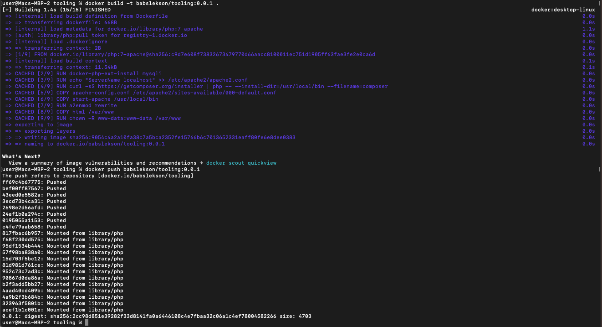
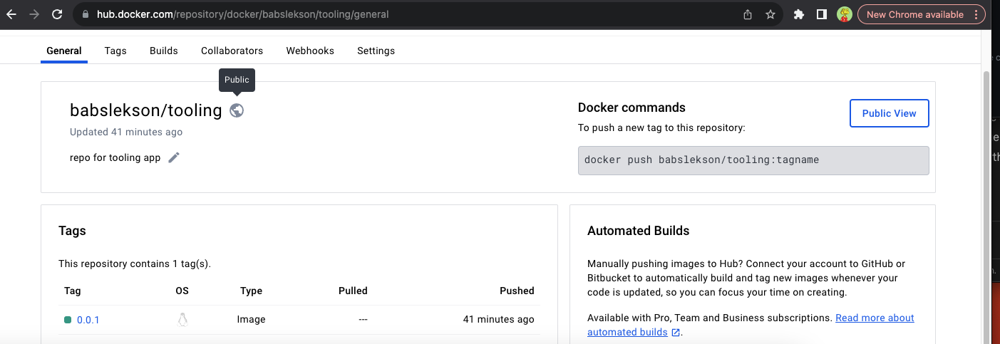

PART 2: TODO APP
Step 1: create a network 
`docker network create --subnet=172.20.0.0/24 todo_app_network`
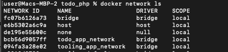

### Step 2: Set up database 
we will run database container from the already pulled mysql-server
```bash
docker run --network todo_app_network -h mysqlhost --name=mysql-server -e MYSQL_ROOT_PASSWORD=$MYSQL_PW -d mysql

docker run --network todo_app_network -p 8085:8000 -it php_todo:0.0.1
```
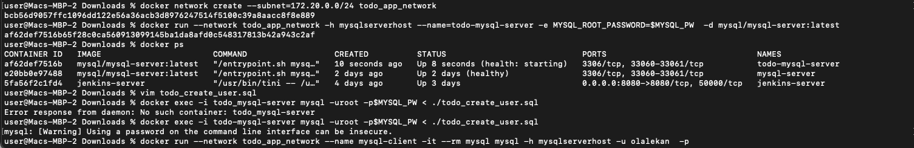
2. Run mysl-client container and create `todo-db`
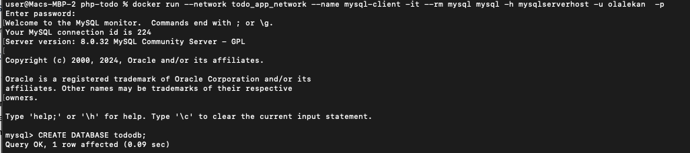


### Step 3: Set up the TODO-PHP app
 1. Clone the PHP-Todo-app repo [here](https://github.com/babslekson/todo_php.git)
 2. update the .env.sample so that the app will be able to connect to the Mysql database
 ```bash
 sudo vim .env.sample 

 DB_HOST=mysqlserverhost
DB_DATABASE=tododb
DB_USERNAME=olalekan
DB_PASSWORD=olalekan12345
```
3. Write a Dockerfile for the todo-php app
```bash
FROM php:7.4.30-cli

# Set the working directory in the container

WORKDIR /var/www/html

# Installl dependencies )

RUN apt update \
        && apt install -y libpng-dev zlib1g-dev libxml2-dev libzip-dev libonig-dev zip curl unzip \
        && docker-php-ext-configure gd \
        && docker-php-ext-install pdo pdo_mysql sockets mysqli zip -j$(nproc) gd \
        && docker-php-source delete

RUN curl -sS https://getcomposer.org/installer | php -- --install-dir=/usr/local/bin --filename=composer

# Copy the rest of the application code into the container
COPY . /var/www/html
RUN mv .env.sample .env

# Expose port 8000 for the Laravel development server
EXPOSE 8000

# Define the command to start the Laravel development server
ENTRYPOINT [ "sh", "serve.sh" ]
```
Content of `serve.sh
```bash
#!/bin/bash

composer install  --no-interaction

php artisan migrate
php artisan key:generate
php artisan cache:clear
php artisan config:clear
php artisan route:clear

php artisan serve  --host=0.0.0.0
```
4. Run the Todo App

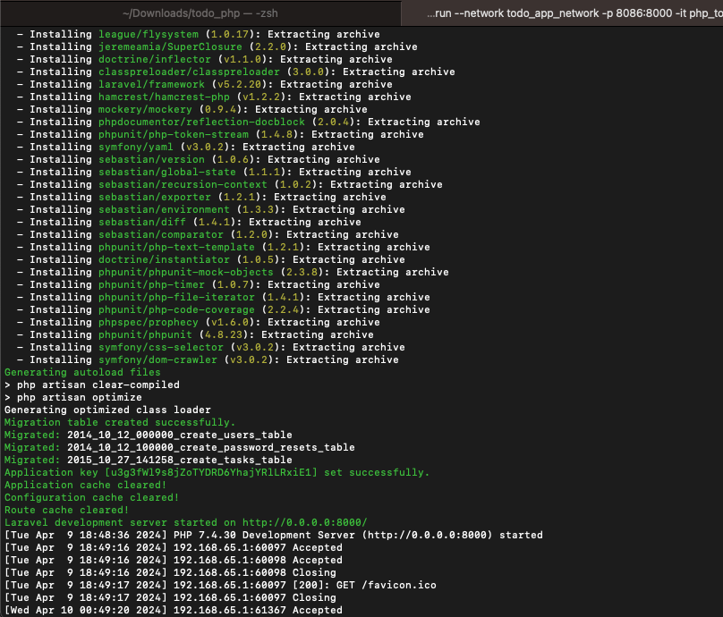
Access the web on your browser
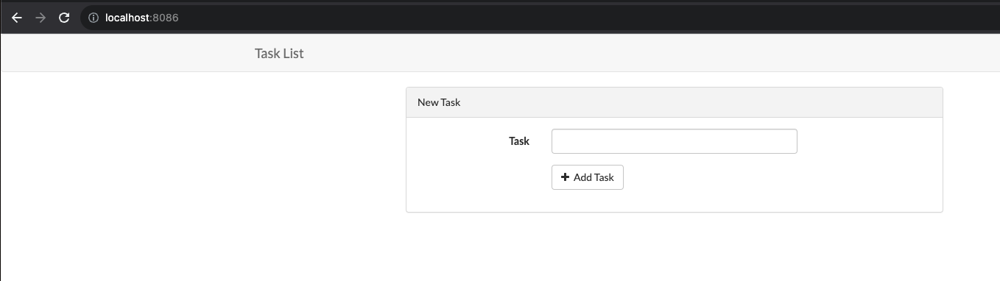

### Push the todo-app image to the repository
```bash
docker login

docker build -t babslekson/php_todo:0.0.1 .

docker push babslekson/php_todo:0.0.1
```
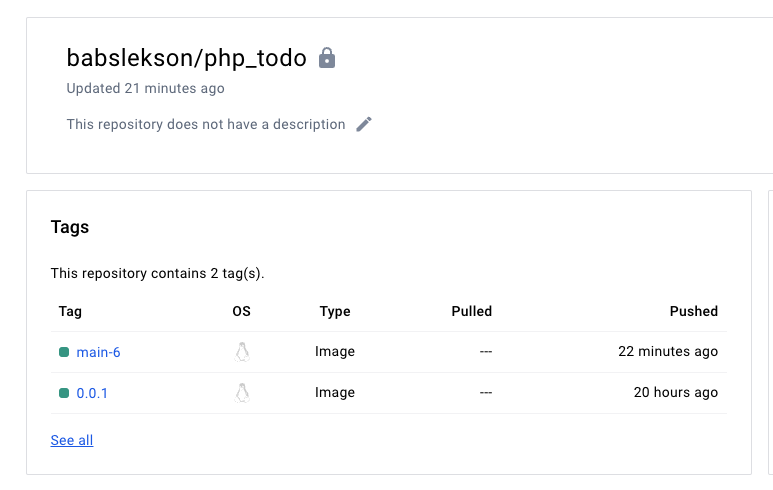

### Part 3
- write a jenkinsfile that will simulate docker build and docker push to the repository.
```bash
pipeline {

        agent any

        environment {
                DOCKERHUB_CREDENTIALS=credentials('Dockerhub')
        }

        stages {
           stage("initial Cleanup") {
                steps {
                        dir("${WORKSPACE}") {
                                deleteDir()
                           }
                     }
                  }


            stage("checkout git") {
                        steps {
                           git branch: 'main', credentialsId: 'Github-id' , url:'https://github.com/babslekson/todo_php.git'
                           }
                        }
            stage ("Building Docker image") {
                steps {
                        script  {
                                sh ' docker build -t babslekson/php_todo:${BRANCH_NAME}-${BUILD_NUMBER} .'

                        }
                 }

             }

        stage ("push image to Docker hub") {
                        steps {
                           script {
                                    sh 'echo $DOCKERHUB_CREDENTIALS_PSW | docker login -u $DOCKERHUB_CREDENTIALS_USR --password-stdin'
                                    sh 'docker push babslekson/php_todo:${BRANCH_NAME}-${BUILD_NUMBER}'
                                }
                             }
             }

            stage ('Cleanup') {
                        steps {
                                cleanWs(cleanWhenAborted: true, cleanWhenFailure: true, cleanWhenNotBuilt: true, cleanWhenUnstable: true, deleteDirs: true)
```
Step 2

1. Push code to github
2. Create ec2 instance and install jenkins
3. Install docker on jenkins server so that simulation can take place. 
4. Install docker  and github plugins under `Manage Jenkins`
5. Configure credentials in jenkins for both docker and github so jenkins can access them
6. Create Job, select multibranch pipeline. make sure you add the git url of the todo-app
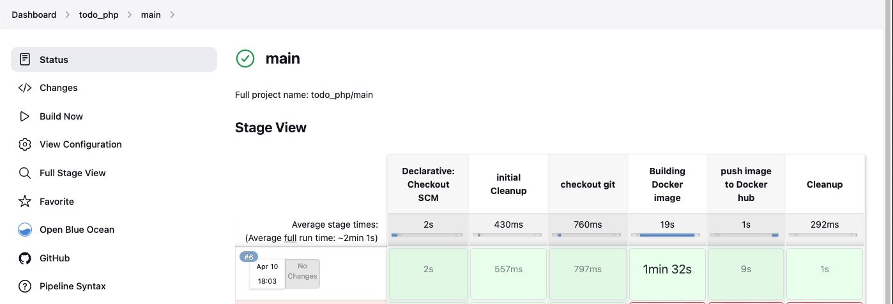
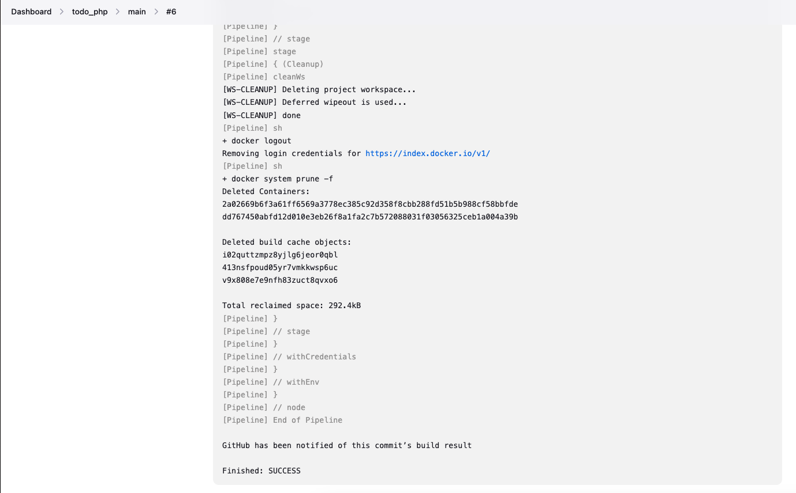


Practide Task - Complete continous integration with a test stage
```bash
stage ('Test Endpoint') {
	steps {
		script {
			while (true) {
				def res = httpRequest 'http://localhost:5000'
			}
		}
	}
}

stage ('Push Image To Docker Hub') {
	when { expression { res.status == 200 } }
	steps {
		script {
			sh 'echo $DOCKERHUB_CREDENTIALS_PSW | docker login -u $DOCKERHUB_CREDENTIALS_USR --password-stdin'

			sh 'docker push babslekson/php_todo:${BRANCH_NAME}-${BUILD_NUMBER}'
		}
	}
}
```